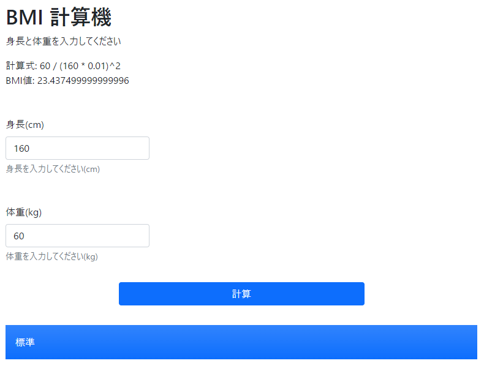
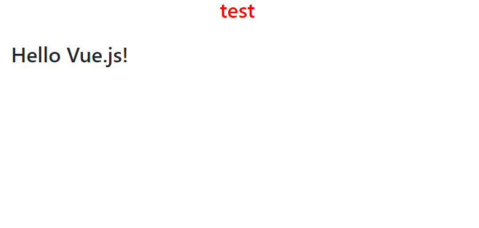
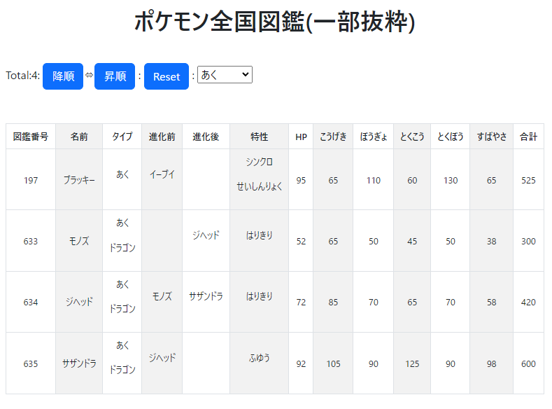

# Vue.js かじってみた。

『 Vue.jsをかじる本 | Zenn 』(URL: https://zenn.dev/sdkfz181tiger/books/363d20b1e591fc ) の一部内容について、仕様を一部変更しながらコンポーネント化したアプリケーション3つです。\
実行方法は上記資料のChapter02 (URL: https://zenn.dev/sdkfz181tiger/books/363d20b1e591fc/viewer/7a8706 ) を参考にしてください。

## BMI計算機　実行例

## Hello World　実行例

## ポケモン全国図鑑(一部抜粋)　実行例

